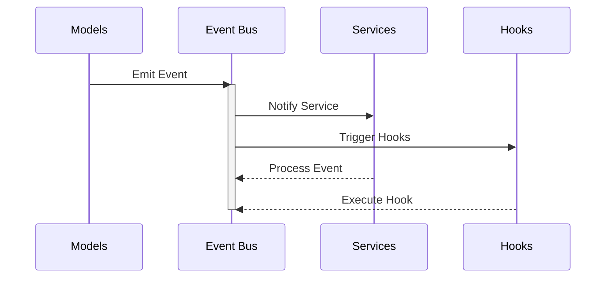

# 🐦 be0 Backend

> 🚀 A robust Go-based backend service with advanced authentication and permission systems.

## ✨ Features

### 🔐 Authentication System
- 🎯 JWT-based authentication with refresh tokens
- 👥 Role-based access control (RBAC)
- 🔑 Password reset functionality with time-limited codes
- 👑 Super admin creation on first run

### 🛡️ Permission System
- 📊 Granular resource-based permissions
- 🏗️ Module-based organization
- 👤 Role-based default permissions
- 🌟 Support for wildcard permissions (e.g., "teams:*")

### 🎯 Supported Modules
#### 1. 🏢 Team Management
   - 🌐 Multi-team support
   - ✉️ Team invitations
   - ⚙️ Team settings

#### 2. 👤 User Management
   - 👑 User roles (Super Admin, Admin, Member)
   - 🔑 Permission management
   - 👤 Profile management

### 🚌 Event Bus System
- 🎯 Decoupled service communication
- ⚡ Asynchronous event handling
- 🔌 Service hooks integration
- 🛡️ Panic recovery in event handlers

#### Event Flow Architecture



#### Available Events
| Event Name | Description | Payload |
|------------|-------------|---------|
| user.registered | Triggered on new registration | UserData |
| team.created | Triggered when a new team is created | TeamData |

#### Example Usage
```go
// Register event handler
events.On("user.created", func(data interface{}) {
    // Handle email sent event
})

// Emit event
events.Emit("user.created", emailData)
```

## 🚀 Getting Started

### 📋 Prerequisites
- 🔧 Go 1.21 or higher
- 🗄️ PostgreSQL 17 or higher
- ⚡ Redis (for rate limiting and caching)

### 🔧 Environment Variables
```env
# 🖥️ Server Configuration
SERVER_HOST=localhost
SERVER_PORT=8080

# 🗄️ Database Configuration
POSTGRES_HOST=localhost
POSTGRES_PORT=5432
POSTGRES_USER=kori_user
POSTGRES_PASSWORD=kori_password
POSTGRES_DB=kori
POSTGRES_SSLMODE=disable

# 🔒 JWT Configuration
JWT_SECRET=your_secure_jwt_secret

# 📁 Storage Configuration
STORAGE_PROVIDER=local
STORAGE_BASE_PATH=./storage

# ⚙️ Worker Configuration
WORKER_CONCURRENCY=5
WORKER_QUEUE_SIZE=100

# 🔄 Redis Configuration
REDIS_HOST=localhost
REDIS_PORT=6379
REDIS_PASSWORD=kori_password
REDIS_DB=0

# 👑 Super Admin Configuration (First Run)
SUPERADMIN_EMAIL=admin@example.com
SUPERADMIN_PASSWORD=secure_password
SUPERADMIN_NAME=Admin
```

### 📥 Installation

1. Clone the repository:
```bash
git clone https://github.com/theboringhumane/be0.go.git
cd be0.go
```

2. Install dependencies:
```bash
go mod download
```

3. Set up the environment:
```bash
cp .env.example .env
# Edit .env with your configuration
```

4. Run migrations:
```bash
go run cmd/migrate/main.go
```

5. Start the server:
```bash
go run cmd/server/main.go
```

### 📚 API Documentation

The API is documented using Swagger/OpenAPI. Access the documentation at:
```
http://localhost:8080/swagger/index.html
```

## 🔐 Authentication

### 📝 Registration
```http
POST /api/v1/auth/register
{
    "email": "user@example.com",
    "password": "secure_password",
    "first_name": "John",
    "last_name": "Doe"
}
```

### 🔑 Login
```http
POST /api/v1/auth/login
{
    "email": "user@example.com",
    "password": "secure_password"
}
```

### 🔄 Password Reset
```http
POST /api/v1/auth/password-reset
{
    "email": "user@example.com"
}
```

### 🔒 Authentication System Architecture

The authentication system supports both traditional email/password authentication and Google OAuth, integrated with JWT-based session management.

```mermaid
graph TD
    subgraph "Traditional Email/Password Authentication"
        A[User Registration/Login] -->|Email & Password| B{Exists?}
        B -->|No - Register| C[Create Team & User]
        C --> D[Assign Default Permissions]
        B -->|Yes - Login| E[Validate Password]
        D --> F[Generate Tokens]
        E -->|Valid| F
        E -->|Invalid| G[Return Error]
        F --> H[Create Auth Transaction]
        H --> I[Return JWT & Refresh Token]
    end

    subgraph "Google OAuth Authentication"
        J[Google Sign-In] -->|ID Token| K[Verify with Firebase]
        K -->|Valid| L{User Exists?}
        L -->|No| M[Create Team & User]
        M --> N[Assign Default Permissions]
        L -->|Yes| O[Update Provider Data]
        N --> P[Generate Tokens]
        O --> P
        P --> Q[Create Auth Transaction]
        Q --> R[Return JWT & Refresh Token]
    end

    subgraph "JWT Token Flow"
        S[Protected API Request] -->|JWT Token| T[Auth Middleware]
        T -->|Validate| U{Token Valid?}
        U -->|Yes| V[Extract Claims]
        V --> W[Set Context]
        W --> X[Continue to Handler]
        U -->|No| Y[Return 401]
    end

    subgraph "Token Refresh Flow"
        Z[Refresh Token Request] -->|Refresh Token| AA{Valid?}
        AA -->|Yes| AB[Get User]
        AB --> AC[Generate New Access Token]
        AC --> AD[Update Auth Transaction]
        AD --> AE[Return New Access Token]
        AA -->|No| AF[Return 401]
    end

    subgraph "Password Reset Flow"
        AG[Reset Request] -->|Email| AH[Generate Reset Code]
        AH --> AI[Store Reset Code]
        AI --> AJ[Send Reset Email]
        AK[Reset Verification] -->|Code & New Password| AL{Valid Code?}
        AL -->|Yes| AM[Update Password]
        AM --> AN[Mark Code Used]
        AL -->|No| AO[Return Error]
    end

    subgraph "Team Invite Flow"
        AP[Team Invite] -->|Email & Role| AQ[Generate Invite Code]
        AQ --> AR[Store Invite]
        AR --> AS[Send Invite Email]
        AT[Accept Invite] -->|Code & Password| AU{Valid Invite?}
        AU -->|Yes| AV[Create User]
        AV --> AW[Assign Team & Role]
        AU -->|No| AX[Return Error]
    end
```



#### Key Components:

1. **🔐 Authentication Methods**
   - 📧 Traditional Email/Password
   - 🔑 Google OAuth via Firebase
   - 📨 Team Invitations

2. **🎟️ Token Management**
   - 🔒 JWT Access Tokens (24h validity)
   - 🔄 Refresh Tokens (7 days validity)
   - 📝 Auth Transaction Tracking

3. **👥 User Management**
   - 🏢 Automatic Team Creation
   - 👑 Role Assignment
   - 🔑 Permission Management

4. **🔒 Security Features**
   - 🔐 Bcrypt Password Hashing
   - ⏰ Time-Limited Reset Codes
   - 🔍 Firebase Token Verification
   - 📊 Transaction-based Operations

5. **🤝 Integration Points**
   - 🔌 Firebase Authentication
   - 📨 Email Service for Notifications
   - 📝 Event System for Tracking

#### Authentication Endpoints:

```http
# Traditional Authentication
POST /api/v1/auth/register     # User Registration
POST /api/v1/auth/login        # User Login
POST /api/v1/auth/refresh      # Token Refresh

# Google OAuth
POST /api/v1/auth/google       # Google Sign-In

# Password Management
POST /api/v1/auth/password-reset         # Request Reset
POST /api/v1/auth/password-reset/verify  # Verify Reset

# Team Management
POST /api/v1/auth/invite       # Send Team Invite
POST /api/v1/auth/accept/:code # Accept Invite
```

## 🛡️ Security Features

1. **⚡ Rate Limiting**
   - 🔒 Request rate limiting per IP
   - 🔑 API key rate limiting
   - ⚙️ Configurable limits

2. **🔒 JWT Security**
   - ⏱️ Short-lived access tokens (24 hours)
   - 🔄 Refresh token support (7 days)
   - 🎯 Permission claims in tokens

3. **🔐 Password Security**
   - 🔒 Bcrypt password hashing
   - ✅ Minimum password requirements
   - 🛡️ Secure password reset flow

4. **🔒 API Security**
   - 🌐 CORS protection
   - 📦 Request size limiting
   - 🛡️ Secure headers
   - 🗜️ GZIP compression

## 👨‍💻 Development

### 📁 Project Structure
```
📦 be0.go
 ┣ 📂 cmd                     # Application entry points
 ┣ 📂 internal               
 ┃ ┣ 📂 api                  # API layer
 ┃ ┃ ┣ 📂 middleware         # Custom middlewares
 ┃ ┃ ┣ 📂 validator          # Request validators
 ┃ ┃ ┗ 📜 server.go          # Server setup
 ┃ ┣ 📂 config               # Configuration
 ┃ ┣ 📂 events               # Event bus system
 ┃ ┣ 📂 handlers             # Request handlers
 ┃ ┣ 📂 models               # Database models
 ┃ ┣ 📂 routes               # Route definitions
 ┃ ┣ 📂 services             # Business logic
 ┃ ┗ 📂 utils                # Utility functions
 ┣ 📂 migrations             # Database migrations
 ┗ 📂 storage                # Local storage
```

### ✨ Adding New Features

1. **📦 New Resource**
   - 📝 Add model in `internal/models/`
   - 🔑 Add permissions in `internal/models/seed.go`
   - 🎯 Create handler in `internal/handlers/`
   - 🔌 Add routes in `internal/routes/`

2. **🔑 New Permission**
   - 📝 Add resource in `defaultResources`
   - 👥 Add permissions in `rolePermissions`
   - 🔄 Run server to auto-seed

## 📄 License

This project is licensed under the MIT License - see the LICENSE file for details. 